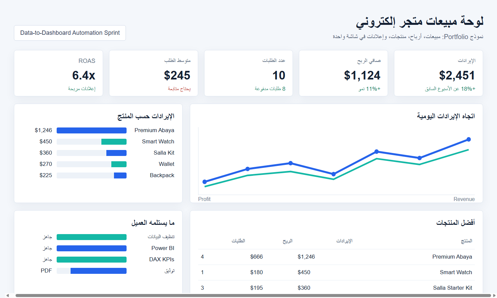
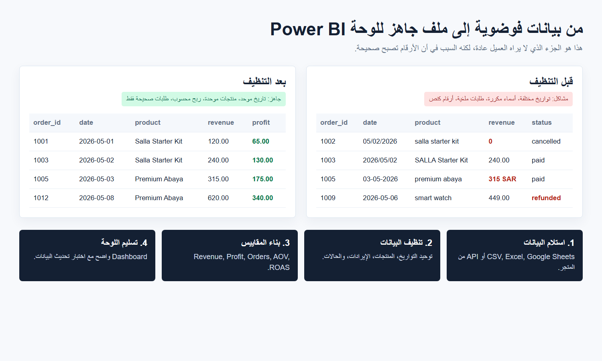
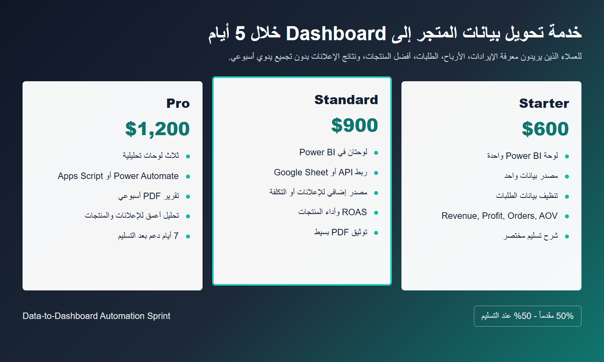

# Data-to-Dashboard Automation Sprint

This folder is the operating kit for selling and delivering a 5-day ecommerce data automation service.

## Offer

Turn messy ecommerce sales data into an auto-updating Power BI dashboard.

## Price Packages

| Package | Scope | Price |
| --- | --- | --- |
| Starter | One dashboard, one data source | 600 USD |
| Standard | Two dashboards, API connection plus ad data | 900 USD |
| Pro | Three dashboards, automation flow, weekly PDF report | 1,200 USD |

## Folder Map

| Folder | Purpose |
| --- | --- |
| `00_Templates` | Contracts, scope, onboarding, delivery checklist |
| `01_Client_Template` | Copy this folder for every new client |
| `02_Code_Library` | Reusable scripts and automation snippets |
| `03_Proposals` | Freelance and outreach message drafts |
| `04_Portfolio_Demo` | Dummy data and public GitHub demo material |
| `05_Portfolio_Images` | Client-facing portfolio images |

## Portfolio Images

Use these images in Mostaql, LinkedIn, WhatsApp, and client proposals.

## Delivery Rhythm

Day 1: Extract data.

Day 2: Clean and model data.

Day 3: Build Power BI model and DAX measures.

Day 4: Design dashboard pages.

Day 5: Test refresh, document, collect final payment, deliver access.
